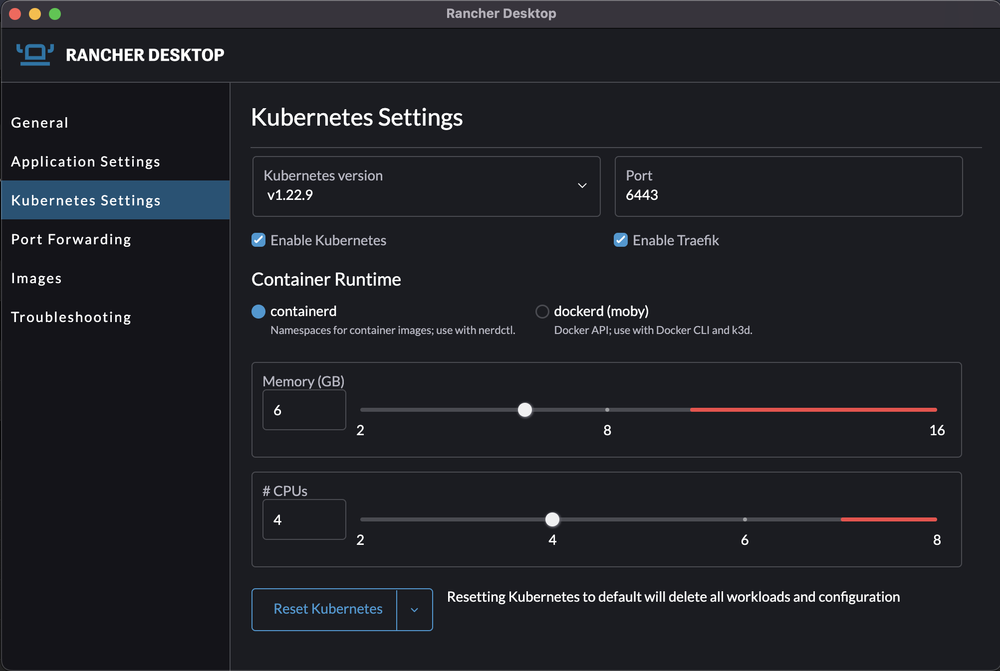
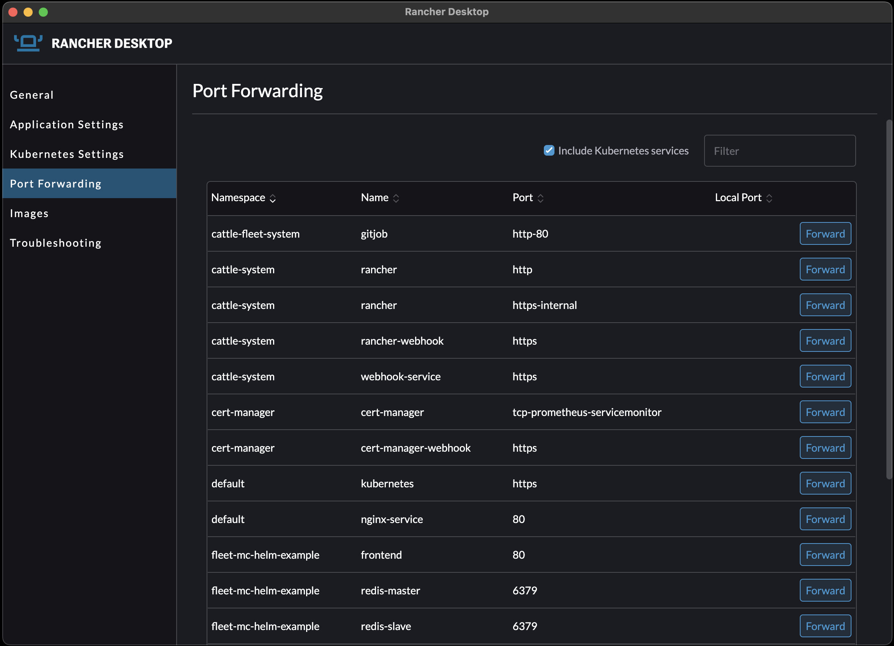
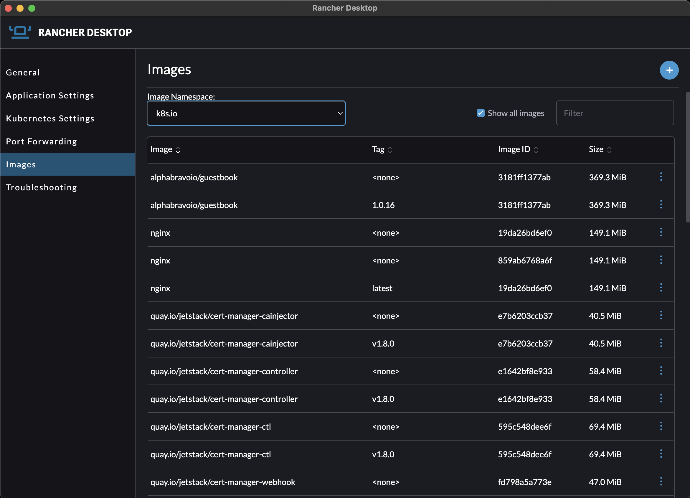
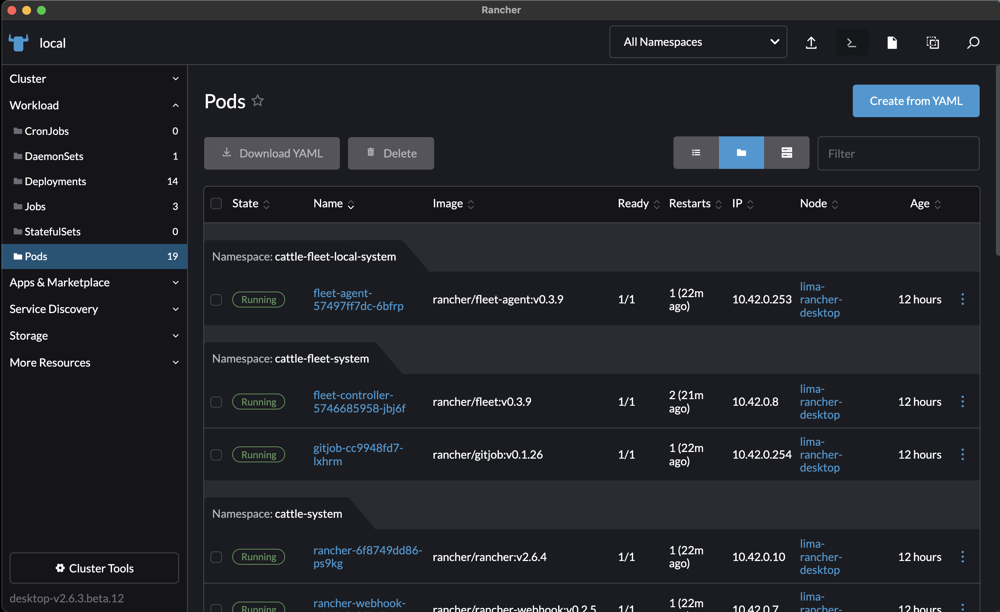

# Lab 01 - Working with Rancher Desktop 1.3+

Once you have installed Rancher 1.3, it is time for you to get comfortable with the interface.

1. With Rancher Desktop lets explore the settings. Click on the RD icon and click "settings". For the sake of being platform agnostic, we will skip OS specific settings.
2. Under `Kubernetes Settings` you will should see a number of option for the version of Kubernetes you want to run, the API port to expose, the container runtime you want to use, CPU and RAM allocation, and more. This is where you can fine tune your deployment as much as you like to suite your current development needs.

3. You can use `Port Forwarding` settings if you have services running inside the cluster exposed on `ClusterIP` and you want to access them on `localhost` at the defined port. 

4. Under the "Images" setting, you can remove images that you no longer need from you local machine via the UI.

5. My favorite feature of this tool is the inclusion of the Rancher Web UI style Dashboard. Click on the Rancher Desktop Icon and click `Dashboard`. This will let you interact with pods, services, deployments, etc and easily access logs, get a shell in a pod, or a number of other Kubernetes functions.

## That's all for Lab 01!